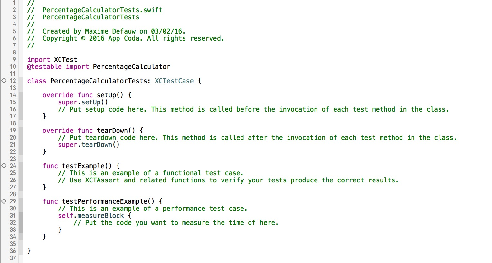
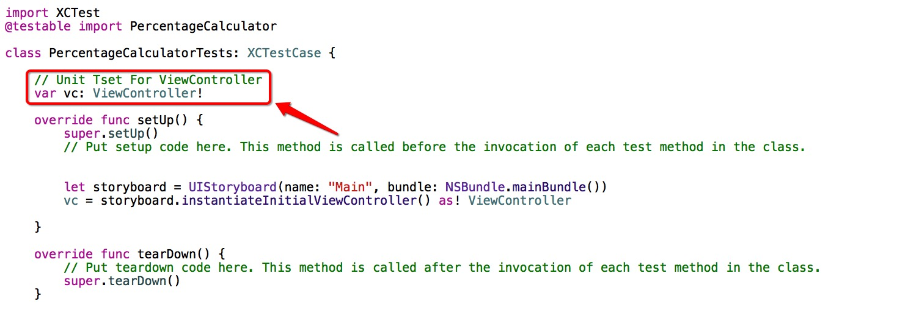
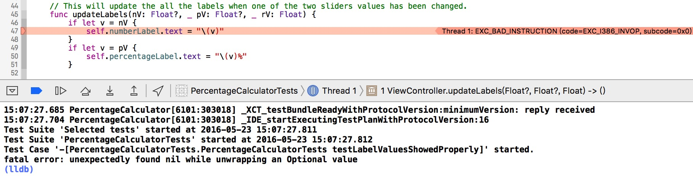
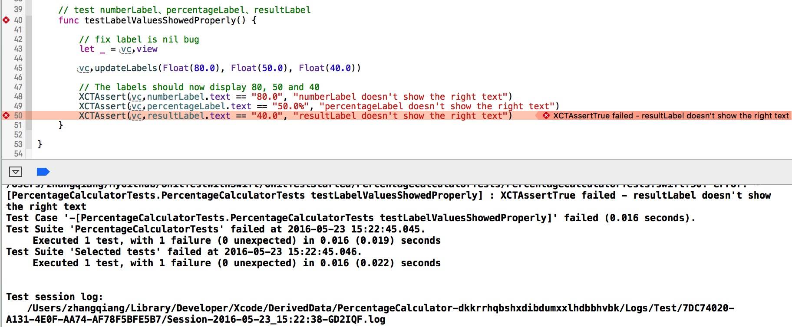
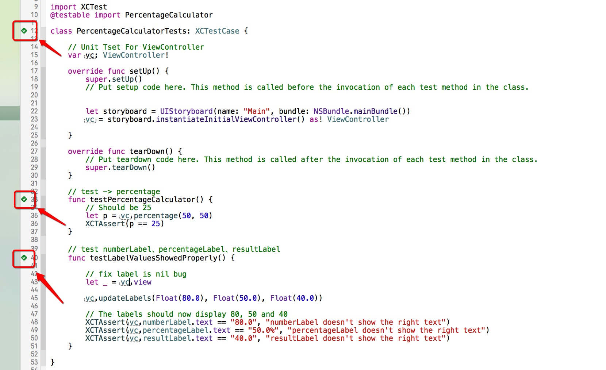

# UnitTestWithSwift
在Xcode 7上使用Swift编写单元测试。[原文地址](http://www.appcoda.com/unit-testing-swift/)

编写单元测试将使你的代码更可靠、安全、容易Debug。虽然单元测试并不意味着App没有bug，但它依然是一个强有力的方式证明每一块或者一个单元的代码正在正确的执行着，这将给调试过程带来极大的便利。

### 一个简单的实例demo：###

[Staring Project](https://github.com/appcoda/SwiftUnitTestDemo/blob/master/PercentageCalculatorStarter.zip?raw=true)

在创建项目的时候，要记得在Unit Test的前面打上勾，如下图：


点开project中的test.swift文件，如图所示：



一共包含4个函数，下面两个函数是示例测试函数，以testXXX开头，注释中包含example字样，是**可以删除**的。

而 `setUp()` 和 `tearDown()` 两个函数是特殊的模板方法。它们分别在每个测试方法执行之前和之后被调用。

### 开始编写单元测试 ###

测试是如何进行测试的呢？基本原理就是你输入固定的参数，经过函数返回值与你预期的对应结果是否相等，或者是否在预期结果集中，如果在，则为true，否则为false。

使用上面提供的Demo中编写单元测试。

首先，我们要对ViewController进行Unit Test。在PercentageCalculatorTests中加入ViewController属性，如下图所示：



首先，给ViewController中percentage函数写测试函数：

```
func testPercentageCalculator() {
	// 结果应该是 25
	let p = vc.percentage(50, 50)
    XCTAssert(p == 25)
}
```
然后，给界面上3个Label的显示结果写测试函数：

```
func testLabelValuesShowedProperly() {
	
	vc.updateLabels(Float(80.0), Float(50.0), Float(40.0))
   
   	// The labels should now display 80, 50 and 40
   	XCTAssert(vc.numberLabel.text == "80.0", "numberLabel doesn't show the right text")
   	XCTAssert(vc.percentageLabel.text == "50.0%", "percentageLabel doesn't show the right text")
	XCTAssert(vc.resultLabel.text == "40.0", "resultLabel doesn't show the right text")
}

```
这里面 `XCTAssert` 中增加了一个参数，如果前面的判断条件正确，测试通过，如果前面的判断条件错误，测试失败，并且在控制台中打印第二个参数中的提示内容。

大功告成，开始跑测试函数，点击函数左侧的小 ◇ ，等待测试完成。

咦？？？ WTF ！！！ 报错了。



为什么会这样呢？

原因是这样，我在Storyboard中创建的这些Label，正因如此，它们在View的 `loadView()` 方法调用的时候才实例化Label。但是做Unit Test的时候 `loadView()` 是没有触发的，这些Label没有创建，所以它们是nil。

一个解决方案是：

调用 `vc.loadView()` 函数，但是苹果官方文档中不建议我们这样做，因为当已加载的对象又被加载时，容易造成内存泄露。

另一个解决方案是：

访问ViewController的view属性，这样它将触发所有需要的函数，并不是简单的 `loadView()` 函数。

最后代码更新成这样：

```
func testLabelValuesShowedProperly() {
	let _ = vc.view
 	vc.updateLabels(Float(80.0), Float(50.0), Float(40.0))
        
	// The labels should now display 80, 50 and 40
	XCTAssert(vc.numberLabel.text == "80.0", "numberLabel doesn't show the right text")
	XCTAssert(vc.percentageLabel.text == "50.0%", "percentageLabel doesn't show the right text")
	XCTAssert(vc.resultLabel.text == "40.0", "resultLabel doesn't show the right text")
}
```
运行测试。



结果发现了错误，resultLabel显示的text是错误的。

我们进入ViewController中寻找哪里是设置resultLabel的text的地方。

我们找到bug：

```
self.resultLabel.text = "\(rV + 10)"
```
正确代码如下所示：

```
self.resultLabel.text = "\(rV)"
```
更新代码，重新跑一下Unit Test:



好了，都通过了，整个世界都和平了。


