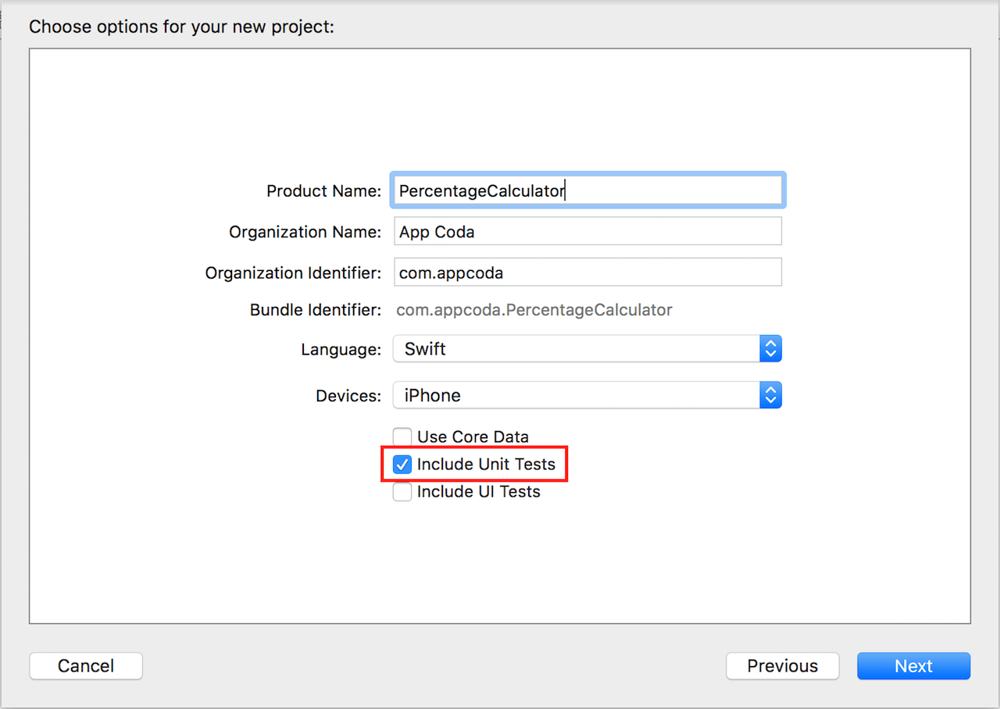
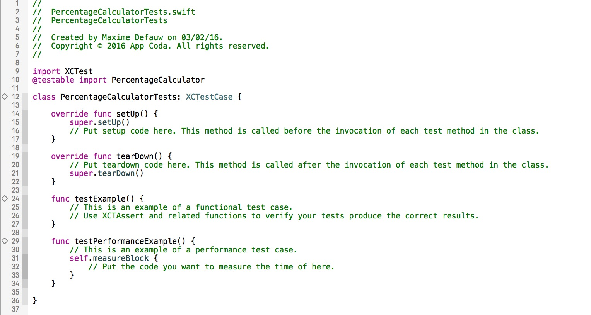

# UnitTestWithSwift
在Xcode 7上使用Swift编写单元测试。[原文地址](http://www.appcoda.com/unit-testing-swift/)

编写单元测试将使你的代码更可靠、安全、容易Debug。虽然单元测试并不意味着App没有bug，但它依然是一个强有力的方式证明每一块或者一个单元的代码正在正确的执行着，这将给调试过程带来极大的便利。

### 一个简单的实例demo：###

[Staring Project](https://github.com/appcoda/SwiftUnitTestDemo/blob/master/PercentageCalculatorStarter.zip?raw=true)

在创建项目的时候，要记得在Unit Test的前面打上勾，如下图：

点开project中的test.swift文件，如图所示：

一共包含4个函数，下面两个函数是示例测试函数，以testXXX开头，注释中包含example字样，是可以删除的。

而 `setUp()` 和 `tearDown()` 两个函数是特殊的模板方法。它们分别在每个测试方法执行之前和之后被调用。

### 开始编写单元测试 ###
使用上面提供的Demo中编写单元测试。

首先，我们要对ViewController进行Unit Test。在PercentageCalculatorTests中加入ViewController属性，如下图所示：

